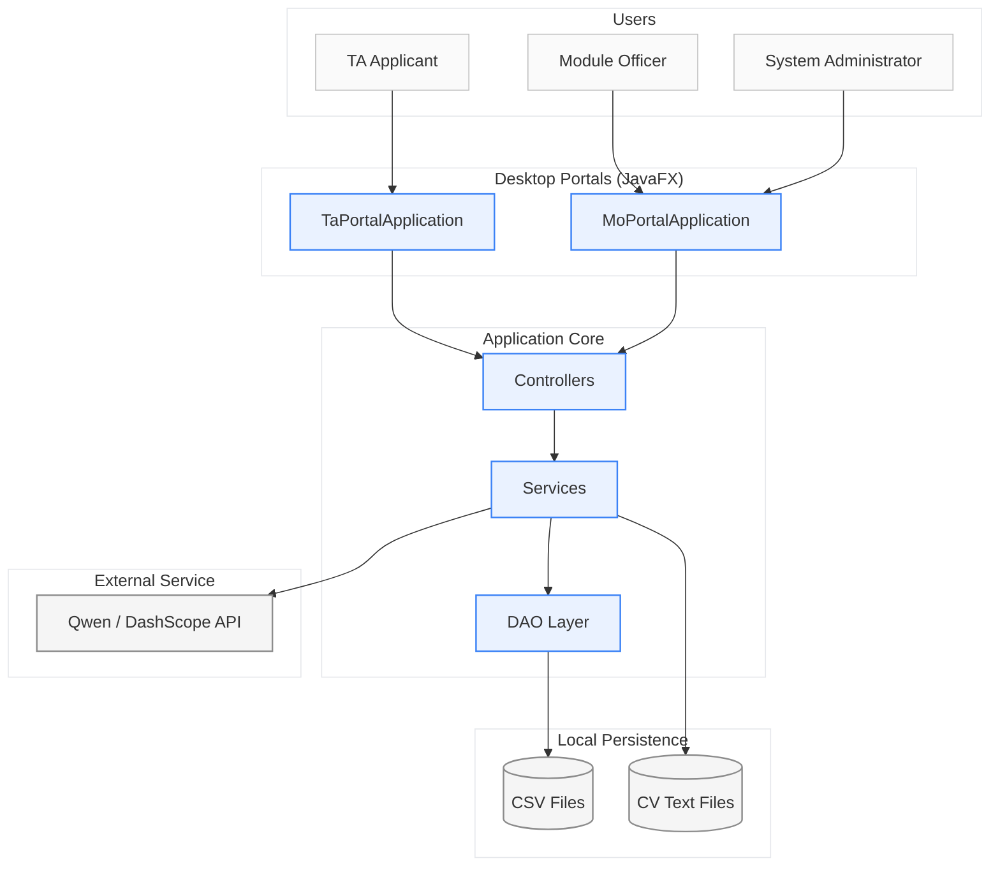
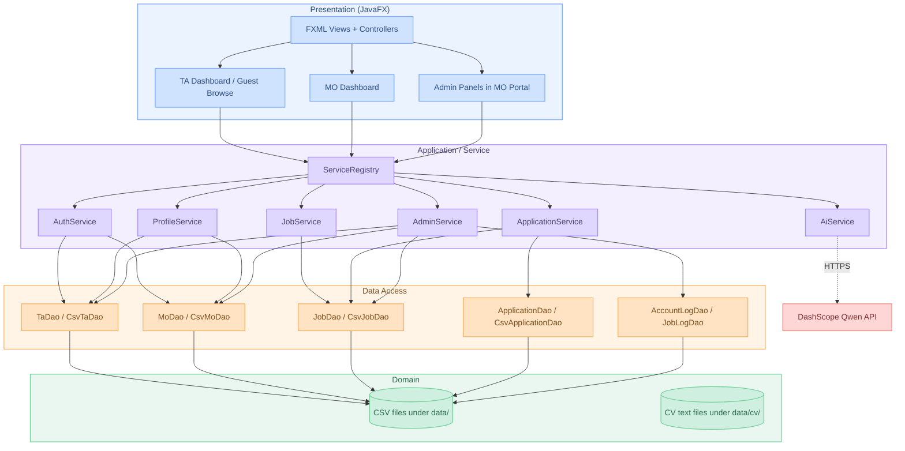
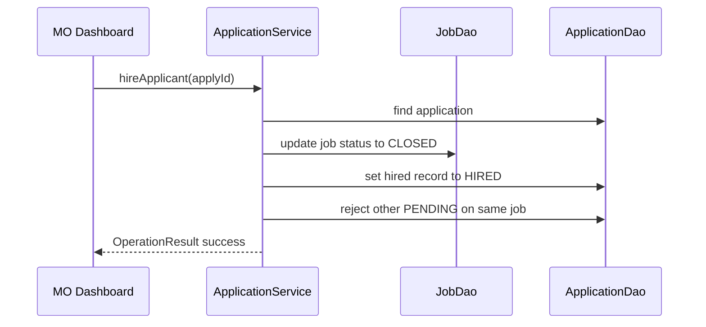

# Report — BUPT TA Recruitment System

## 1. Design

### 1.1 Design Strategy

Our design strategy prioritises **modularity**, **testability**, and **maintainability** while meeting course requirements for a multi-role desktop system. We adopted the following guiding ideas:

- **Layered architecture** — separate concerns into presentation, application/service, and persistence layers.
- **High cohesion, loose coupling** — each package has a single responsibility; layers communicate through narrow interfaces.
- **Design for testability** — business rules live in services that do not depend on JavaFX; UI controllers delegate to services.
- **Incremental refinement** — start with core flows (login, job posting, apply, hire) and extend with admin, logging, and AI features and so on.

We also mapped our solution to the **4+1 Architectural View Model**:

| View | How it applies to our system |
|------|------------------------------|
| **Logical** | Domain entities (`Ta`, `Mo`, `Job`, `ApplicationRecord`) and services (`AuthService`, `JobService`, `ApplicationService`, …). |
| **Development** | Maven module structure: `entity`, `dao`, `service`, `controller`, `viewmodel`, `util`. |
| **Process** | Synchronous request/response within a single desktop JVM; `AiService` uses async HTTP but blocks on the UI thread with timeouts. |
| **Physical** | Two deployable JARs (`tarecruit-ta-*.jar`, `tarecruit-mo-*.jar`) plus a shared `data/` directory on the local filesystem. |
| **Scenarios** | Example — *MO hires one applicant*: **Logical** — `Mo`, `Job`, `ApplicationRecord`; `ApplicationService` sets one record to `HIRED`, others to `REJECTED`, job to `CLOSED`. **Development** — `MoDashboardController` → `ApplicationService` → `CsvApplicationDao` / `CsvJobDao` (`entity`, `service`, `controller`). **Process** — UI-thread Hire click → synchronous service and CSV writes → `OperationResult` back to UI. **Physical** — `tarecruit-mo-*.jar` on the officer’s PC updates local `data/Jobs.csv` and `data/Applications.csv`. |

### 1.2 System Context and Architecture

The system serves three roles—**TA** (applicant), **MO** (hiring staff), and **ADMIN** (system administrator)—through two separate portals to enforce account separation and simplify UX.

#### Layered Architecture

| Layer | Package / artefacts | Responsibility |
|-------|---------------------|----------------|
| **Presentation** | `controller`, FXML under `resources/fxml`, `viewmodel` | User interaction, scene navigation, binding display models. |
| **Application / Service** | `service` | Authentication, jobs, applications, profiles, admin operations, AI orchestration. |
| **Data Access** | `dao` (+ `Csv*Dao` implementations) | CRUD and queries over CSV-backed stores. |
| **Domain** | `entity` | Persistent domain objects and enumerations (`Role`, `JobStatus`, `ApplicationStatus`). |
| **Infrastructure** | `util` | Validation, CSV I/O, ID generation, file storage, navigation. |

### 1.3 Component Design and EBC Mapping

We adapted the **Entity–Boundary–Control (EBC)** pattern from the course slides to structure responsibilities:

| EBC role | Implementation | Examples |
|----------|----------------|----------|
| **Entity** | `entity` package | `Ta`, `Mo`, `Job`, `ApplicationRecord`, `AccountLog` |
| **Boundary** | FXML + `controller` + `viewmodel` | `LoginController`, `TaDashboardController`, `ApplicantDisplay` |
| **Control** | `service` package | `ApplicationService.hireApplicant()`, `AuthService.login()` |

**MVC** is applied within each portal: FXML defines the **View**, controllers handle **input events**, and services/entities hold **Model** logic and state. Controllers remain thin—they validate UI input, call services, and map results to dialogs or observable lists.

### 1.4 Key Design Decisions

1. **Dual portals** — `TaPortalApplication` and `MoPortalApplication` share `ServiceRegistry` but use `PortalMode` to restrict login and navigation. This prevents TA accounts from accessing MO features and vice versa.

2. **CSV persistence** — No database server is required for coursework deployment. DAO interfaces (`TaDao`, `JobDao`, …) allow future replacement (e.g. SQLite) without rewriting services (**Dependency Inversion**).

3. **`ServiceRegistry` as composition root** — A single entry point wires all DAOs and services, bootstraps default data via `DataBootstrapper`, and exposes dependencies to controllers (**Facade** pattern).

4. **`OperationResult<T>`** — Service methods return explicit success/failure with messages instead of throwing for expected business-rule violations (e.g. duplicate application). This keeps controllers consistent and simplifies testing.

5. **ViewModels** — Display-specific DTOs (`TaJobDisplay`, `ApplicantDisplay`, `AdminJobDisplay`) decouple UI tables/cards from entity classes (**Single Responsibility**).

6. **AI as optional enhancement** — `AiService` is isolated; offline fallbacks (e.g. `fallbackApplicantSummary`) ensure core hiring workflows work without network access.

### 1.5 Design Principles and Patterns

#### SOLID Principles

| Principle | Application examples in our codebase |
|-----------|----------------------------|
| **SRP** | `ApplicationService` handles only application lifecycle; `JobService` handles job CRUD and status. |
| **OCP** | New DAO implementations can be added behind interfaces without changing services. |
| **LSP** | `CsvTaDao` and `CsvMoDao` honour `TaDao` / `MoDao` contracts. |
| **ISP** | Separate DAO interfaces per aggregate rather than one monolithic data API. |
| **DIP** | Services depend on `ApplicationDao`, `JobDao`, not concrete CSV classes. |

#### Design Patterns

| Pattern | Where used | Purpose |
|---------|------------|---------|
| **Facade** | `ServiceRegistry` | Unified access to subsystems for controllers. |
| **Factory** | `IdGenerator` | Consistent ID creation for jobs and applications. |
| **Singleton** | One `ServiceRegistry` per application instance | Shared service graph for a portal session. |
| **Adapter** | `Csv*Dao` implementing `*Dao` interfaces | CSV storage adapted to domain-oriented APIs. |
| **Strategy** (conceptual) | `AiService` prompt templates per feature | Interchangeable AI “algorithms” (recommend jobs, summarise applicants, generate keywords). |
| **Template Method** (conceptual) | `BaseController` / `BaseUiTest` | Shared setup and alert-handling for UI tests. |

### 1.6 Core Domain Flow — Hire Applicant

When an MO hires a candidate, business rules cascade: the job closes, the chosen application becomes `HIRED`, and other pending applications for that job become `REJECTED`.

### 1.7 Design Quality

Against the quality attributes emphasised in lectures, our design targets:

- **Meets requirements** — Supports the required TA lifecycle, MO lifecycle, and administrator capabilities, with separate TA and MO/Admin portals and role-based access control.
- **Modular** — Six primary packages with documented `package-info.java` intent.
- **Maintainable** — JavaDoc on public APIs; consistent naming (`CsvJobDao`, `JobService`).
- **Understandable** — Role-based portals and explicit status enums.
- **Testable** — 168 automated tests; services testable with `@TempDir` CSV fixtures.

---

## 2. Implementation

### 2.1 Implementation Strategy

Implementation followed a **design-to-code mapping** process:

1. **Establish skeleton** — Maven project, JavaFX dependencies, package layout, `ServiceRegistry`.
2. **Implement persistence** — CSV DAOs and `CsvUtil` for read/write.
3. **Implement services** — Auth, jobs, applications, profiles (core business rules).
4. **Build UI** — FXML screens and controllers per portal.
5. **Add admin and audit** — Account logs, job logs, admin tabs.
6. **Integrate AI** — `AiService` with Qwen API and graceful degradation.
7. **Package and document** — Fat JARs via `maven-assembly-plugin`, README, User Manual.

We followed **coding standards** agreed by the team:

- Java 21 with `release` compiler flag.
- UTF-8 source encoding.
- Meaningful class/method names (`findActiveApplicationsForJob`, `normalizePendingApplicationsForClosedJobs`).
- JavaDoc on public service and DAO APIs.
- Commit messages: `[Type]: [Description]` (`feat`, `fix`, `test`, `doc`, `refactor`, `chore`).

### 2.2 Technology Stack

| Component | Choice |
|-----------|--------|
| Language | Java 21 |
| UI | JavaFX 21 + FXML + BootstrapFX |
| Build | Apache Maven 3.x |
| Persistence | OpenCSV-backed CSV files in `data/` |
| Testing | JUnit 5, TestFX 4.x |
| AI (runtime) | Qwen (`qwen-plus`) via DashScope HTTP API |
| Packaging | `maven-assembly-plugin` → standalone JARs per portal |

### 2.3 Project Build Plan (Incremental / Agile)

We planned work in **four sprints**, each ending in a **versioned release** on GitHub (four releases in total). The sprint goals below follow our initial Product Backlog; during implementation we refined scope as we learned more about real usage.

| Sprint | Release | What the increment delivered |
|--------|---------|------------------------------|
| **1** | v1.0 | **Foundation:** Maven/JavaFX skeleton, CSV persistence, `ServiceRegistry`; TA/MO registration and login, admin login; TA guest job browsing; MO view own postings, view applicant list, edit/close jobs; shared dialog utilities. |
| **2** | v2.0 | **Core recruitment flows:** TA apply, profile, CV upload, view/withdraw applications and status; MO post new jobs, hire/reject applicants, MO profile, view applicant details and CV; admin manage TA/MO accounts and all jobs; unified exception handling. |
| **3** | v3.0 | **Search and AI matching:** TA keyword job search and AI job recommendations; MO applicant keyword search and AI-ranked applicants; admin workload-imbalance recognition for TAs. |
| **4** | v4.0 | **Advanced AI and admin analytics:** TA AI fill profile from CV and résumé/job-target advice; MO AI job keywords and similar-applicant suggestions; admin workload overview, recruitment statistics, 30-day AI insights; Javadoc and user-facing documentation polish. |

**Evolving requirements:** The backlog was a starting point, not a frozen contract. As we built and demoed each release, we added or strengthened features that were not fully spelled out in early stories—for example **dual-portal entry with strict login isolation** (TA vs MO/Admin), and **AI-generated one-line applicant summaries** on MO applicant cards to speed screening.

**Continuous Integration:** A GitHub Actions workflow runs the automated test suite on each push/PR to `main` (details in §3.3); developers also run `mvn clean test` locally before merging.

### 2.4 Version Control and Collaboration (GitHub)

The team used a single **GitHub** repository with **`main`** as the integration branch. When working on a task, a developer typically **created a personal branch**, implemented the change there, and **merged back into `main`** after review.

Delivery was aligned with agile practice in a simple way: **four sprints produced four product versions**, each tagged and published as a **GitHub Release** (v1.0 → v4.0), so milestones on the backlog correspond to installable increments rather than only commit history.

#### Collaboration practices

| Practice | Description |
|----------|-------------|
| **Repository** | One shared repo; `main` as the stable line; short-lived personal branches for individual work. |
| **Pull Requests** | Changes merged via PR when appropriate, with a short description of what was done. |
| **Code review** | Peer review before merge; checks include tests passing, clear naming, error handling, and no duplicated logic. |
| **Commit convention** | `[Type]: [Description]` (`feat`, `fix`, `test`, `doc`, `refactor`, `chore`) for traceability. |
| **Releases** | Four GitHub Releases matching the four sprint increments (see §2.3). |
| **CI** | GitHub Actions runs `verify` on push/PR (see §2.3). |
| **Issue tracking** | GitHub Issues for bugs, tasks, and sprint items. |
| **Documentation** | `/doc` for manuals and report; README for setup and 
run instructions. |

#### Team roles (6 members)

| Member | Primary responsibilities |
|--------|------------------------|
| **Siyan Wu** (Lead) | project skeleton, login/register, data layer, initial UI, AI service skeleton; workload pressure checks; AI one-line applicant summaries; CI pipeline and overall integration management. |
| **Xinzhu Wang** | TA job browse and apply, TA job search, AI job recommendations, AI résumé advice; UI polish. |
| **Shuyu Zhu** | TA view/withdraw applications, TA profile page, AI fill online profile from uploaded CV; UI polish. |
| **Yuan Zhang** | MO post/edit jobs, MO browse and open/close own postings, AI generate job keywords; functional testing. |
| **Liying Wu** | MO select/hire applicants, MO applicant search, AI recommend applicants, AI recommend similar candidates; unit testing. |
| **Jie Sun** | Admin reset password, disable users, manage all jobs, insights (including AI 30-day summary), account and job logs; integration testing. |

Work was organised mainly by **feature ownership**; the lead coordinated interfaces (`*Dao`, `OperationResult`, portal modes) and release merges.

---

## 3. Testing

### 3.1 Testing Strategy

Our testing strategy addresses both goals from the course material:

1. **Validation testing** — Confirm the system meets requirements (correct hire/reject behaviour, portal separation, admin disable account).
2. **Defect testing** — Find faults in services, DAOs, and UI controllers before release.

We applied a **test pyramid** biased toward fast, deterministic tests:

| Level | Scope | Tools / approach |
|-------|-------|------------------|
| **Unit** | Services, utilities, entities, DAOs with `@TempDir` | JUnit 5 |
| **Integration** | Service + real CSV DAO on temporary files | JUnit 5 |
| **UI / component** | Controllers with JavaFX TestFX | TestFX + JUnit 5 |
| **System / manual** | Full portals against sample `data/` | Manual scripts in User Manual |
| **Regression** | Full suite on every push/PR and before merge to `main` | Maven Surefire locally; GitHub Actions CI |

### 3.2 Testing Techniques

#### Black-box testing

We derived tests from **requirements and input domains** without inspecting implementation structure:

- **Equivalence partitioning** — Valid vs invalid `@bupt.edu.cn` emails; enabled vs disabled accounts; `OPEN` vs `CLOSED` jobs.
- **Boundary value analysis** — Empty passwords, whitespace-only fields (`ValidationUtilTest`), zero positions, concurrent job threshold (`WorkloadRules.CONCURRENT_JOB_WARNING_THRESHOLD = 2`).

#### White-box testing

For critical services we targeted **branch and path coverage**:

- All branches in `ApplicationService.applyForJob()` (duplicate active application, closed job, success).
- Hire path that closes job and rejects pending competitors (`ApplicationServiceTest`).
- State normalisation when jobs close (`ApplicationServiceStateTest`).

#### How test cases were designed

We started from **user stories and acceptance criteria** in the product backlog (e.g. apply, hire, portal login rules), then mapped each story to one or more **test cases** with explicit setup, input, and expected outcome. **Black-box** cases were written from input partitions and boundaries without reading method bodies; **white-box** cases were added for complex services where branch coverage mattered. Each test method names the behaviour under check (e.g. `duplicateActiveApplicationShouldBeRejected`), and UI flows were covered with TestFX once the corresponding FXML screen existed. New tests were added in the same sprint as the feature, then kept in the regression suite for later sprints.

### 3.3 Test Infrastructure

- **`@TempDir`** — Each test uses an isolated CSV dataset, avoiding cross-test pollution.
- **`BaseUiTest`** — Boots JavaFX toolkit once, creates fresh `ServiceRegistry` per test, auto-dismisses alert dialogs for stable TestFX automation.
- **Parameterized tests** — e.g. `ValidationUtilTest` runs multiple blank/whitespace inputs in one method.
- **Automated CI** — The same suite runs in GitHub Actions on every push and pull request to `main`: JDK 21, Linux headless display via `xvfb-run`, and `./mvnw -B verify` (compile, test, package). Failed runs upload Surefire reports; successful runs retain packaged JAR artefacts. This gives the team a shared regression gate independent of any single developer machine.

### 3.4 Test Case Design — Examples

#### Example A — Unit test (white-box + validation)

**Module:** Application lifecycle  
**Component:** `ApplicationService`  
**Purpose:** Verify hire closes job and rejects other applicants  

| Field | Value |
|-------|-------|
| **Setup** | Open job with 1 position; two TAs apply |
| **Input** | `hireApplicant(applyId)` for first application |
| **Expected** | Job → `CLOSED`; hired → `HIRED`; other → `REJECTED` |
| **Actual** | Matches expected (`ApplicationServiceTest.applyAndHireApplicantFlow`) |
| **Result** | **Pass** |

#### Example B — Edge case / business rule (black-box)

**Module:** Applications  
**Component:** `ApplicationService`  
**Purpose:** Prevent duplicate active applications  

| Field | Value |
|-------|-------|
| **Setup** | One TA, one open job |
| **Input** | `applyForJob` twice with same `taId` |
| **Expected** | First success; second failure with “already” message |
| **Actual** | `duplicateActiveApplicationShouldBeRejected` — Pass |

#### Example C — Authentication (equivalence classes)

**Module:** Security  
**Component:** `AuthService`  
**Purpose:** Disabled accounts cannot log in  

| Field | Value |
|-------|-------|
| **Input** | Login with `disabled=true` TA |
| **Expected** | `success == false`, message contains “disabled” |
| **Result** | **Pass** (`loginDisabledTaShouldFail`) |

#### Example D — UI test (TestFX)

**Module:** TA Portal  
**Component:** `LoginController`  
**Purpose:** Wrong portal shows error for MO credentials on TA portal  

| Field | Value |
|-------|-------|
| **Setup** | Navigate to TA login scene |
| **Input** | Enter MO account credentials, click Sign in |
| **Expected** | Error dialog with portal mismatch message |
| **Result** | **Pass** (in `LoginControllerUiTest`) |

#### Example E — AI fallback (no network)

**Module:** AI  
**Component:** `AiService.fallbackApplicantSummary`  
**Purpose:** Offline summary when API unavailable  

| Field | Value |
|-------|-------|
| **Input** | TA with skills string; empty CV |
| **Expected** | Non-blank summary without “incomplete” |
| **Result** | **Pass** (`AiServiceFallbackTest`) |

### 3.5 Test Results Summary

The full automated suite is run **locally** (`mvn clean test` or `mvn verify`) and **in CI** on each push/PR via GitHub Actions (see §2.3, §3.3). The latest run reported:

| Metric | Value |
|--------|-------|
| **Test classes** | 26 |
| **Total test methods** | 168 |
| **Failures** | 0 |
| **Errors** | 0 |
| **Skipped** | 0 |
| **Overall status** | **PASS** |

#### Breakdown by area

Counts below are from the Surefire report for the same run (8 service test classes include `AiServiceFallbackTest`).

| Area | Test classes (examples) | Tests |
|------|-------------------------|------:|
| **Services** | `AuthServiceTest`, `ApplicationServiceTest`, `ApplicationServiceEdgeCaseTest`, `ApplicationServiceStateTest`, `JobServiceTest`, `ProfileServiceTest`, `AdminServiceTest`, `AiServiceFallbackTest` | 63 |
| **DAO** | `CsvTaDaoTest`, `CsvMoDaoTest`, `CsvJobDaoTest`, `CsvApplicationDaoTest`, `CsvAccountLogDaoTest`, `CsvJobLogDaoTest` | 11 |
| **Controllers (UI)** | `LoginControllerUiTest`, `RegisterControllerUiTest`, `TaDashboardControllerUiTest`, `MoDashboardControllerUiTest`, `ChangePasswordDialogControllerUiTest`, `InsightsDialogControllerUiTest` | 70 |
| **Utilities** | `ValidationUtilTest`, `IdGeneratorTest`, `IdFormatUtilTest`, `DateTimeUtilTest`, `FileStorageHelperTest` | 21 |
| **Entity** | `EntityEnumTest` | 3 |
| **Total** | 26 classes | **168** |

#### Defects found during testing

Testing found and fixed issues such as duplicate applications after withdraw, incorrect updates to already-hired records when a job closed, MO accounts signing in on the TA portal, and brittle MO applicant summaries when the AI API failed. Most were caught by automated tests; the AI fallback was confirmed manually and then covered by `AiServiceFallbackTest`.

---

## 4. The Use of Generative AI (GenAI)

### 4.1 GenAI Tools Used in Development

| Stage | Tool(s) | How we used them |
|-------|---------|------------------|
| **Requirements & planning** | ChatGPT / Cursor | Brainstorming user stories, drafting backlog items, clarifying MO vs ADMIN permissions |
| **Design** | Cursor, ChatGPT | Drafting architecture diagrams, reviewing EBC/MVC mapping, suggesting package structure |
| **Implementation** | **Cursor** (primary IDE assistant), ChatGPT | Boilerplate reduction, FXML/controller wiring hints, CSV DAO read/write patterns, JavaDoc drafts |
| **Testing** | Cursor | Generating JUnit 5 skeletons, suggesting edge cases (`ApplicationServiceEdgeCaseTest`), TestFX setup in `BaseUiTest` |
| **Debugging** | Cursor | Explaining stack traces, suggesting fixes for JavaFX threading and TestFX timing |

### 4.2 Effectiveness Evaluation

**Strengths observed:**

- **Faster first drafts** — DAO and test class scaffolding reduced repetitive typing.
- **Context-aware suggestions** — Cursor understood multi-file JavaFX projects and proposed consistent `OperationResult` usage.
- **Edge-case discovery** — Prompting for “what can go wrong with hire?” led to dedicated edge-case tests.
- **Shorter feedback loops** — Developers iterated on service APIs with immediate AI explanations of compiler errors.

### 4.3 Limitations and Challenges

| Challenge | Description | Our mitigation |
|-----------|-------------|----------------|
| **Hallucinations** | AI suggested non-existent APIs or wrong JavaFX APIs | Mandatory human review; compile and test before merge |
| **Insecure code** | Generated code may omit validation | Code review checklist; `ValidationUtil`, portal guards |
| **Inconsistent style** | Mixed naming or overly verbose solutions | Team conventions in README; refactor before merge |
| **Over-reliance** | Risk of not understanding hire/reject rules | Pair review on `ApplicationService`; explicit unit tests |
| **Privacy & keys** | API keys and CV text sent to cloud | Keys via env/properties; user informed in User Manual |
| **Non-deterministic output** | Qwen JSON may be malformed | Parsing guards, `IOException` handling, offline fallback |
| **Test fragility** | AI-generated UI tests can be flaky | Shared `BaseUiTest`, stable `fx:id`s, headless-friendly JVM flags |

### 4.4 Responsible Use Policy (Team Agreement)

1. **All AI-generated code is reviewed** by a human developer before merge.  
2. **All AI-generated code is tested** — at minimum `mvn test` for touched modules.  
3. **No secrets** in prompts or committed files; API keys only in local config.  
4. **Developers remain accountable** for correctness, security, and coursework compliance.  
5. **Report transparency** — This section documents both development-time GenAI (Cursor/ChatGPT) and product-embedded GenAI (Qwen).

---

## 5. Individual Member Contributions and Reflections

### 5.1 Siyan Wu (Project Lead)

#### Main contribution

As project lead, I set up the Maven/JavaFX skeleton, layered packages, CSV DAOs, `ServiceRegistry`, and `OperationResult<T>`. I implemented dual-portal login/register, AI applicant summaries, workload checks, `AiService` fallbacks, and GitHub Actions CI. I coordinated interface contracts, pull-request merges, and four GitHub Releases (v1.0–v4.0).

#### Reflective statement

Software engineering here was as much about **process** as about code. We ran four agile sprints with a versioned release at each end; my role was to keep `main` integratable while five teammates worked on feature branches. That meant agreeing DAO interfaces early, writing a short PR description, and refusing merges when `mvn verify` failed locally or in CI. GitHub Issues tracked bugs and backlog items; our commit convention (`feat`, `fix`, `test`, …) made history readable during review.

GenAI (Cursor/ChatGPT) was part of the toolchain, not a substitute for engineering discipline. We adopted a team rule: AI-generated changes must be reviewed and tested before merge—matching coursework expectations for responsible GenAI use. I sometimes over-focused on implementation when facilitation would have helped more; a per-sprint “interface changelog” and earlier cross-portal demos would reduce late integration surprises.

CI with 168 tests became our shared quality gate; flaky TestFX runs taught us that test infrastructure is product work. I learned that scoping AI as optional enhancement kept demos reliable when the network failed. Facilitating sprint retros—what to defer, what blocked others—was as important as merging code. Overall this project trained me in technical leadership: architecture, collaboration, release management, and accountability—not only Java syntax. Delivering four named releases on GitHub made progress visible to the whole group.

---

### 5.2 Xinzhu Wang

---

### 5.3 Shuyu Zhu

---

### 5.4 Yuan Zhang

---

### 5.5 Liying Wu

---

### 5.6 Jie Sun
#### Main contribution

I delivered admin password reset, account enable/disable, all-jobs management, account/job audit logs, insights (statistics, workload, 30-day AI summary), and **integration testing** across TA/MO/admin flows including TestFX for admin tabs.

#### Reflective statement

Admin and integration work highlighted **systems thinking**. Low-frequency features (reset password, disable account) carry high risk; our engineering response was end-to-end checks—disabled users cannot log in on either portal, admin job close propagates to MO/TA views, insights load on first open—documented in manual scripts and automated tests where stable. I planned test paths across sprints rather than only in Sprint 4, though earlier start would have smoothed load.

Logs via `AdminService` and CSV log DAOs are **non-functional requirements**: auditability supports accountability in a coursework system mimicking real operations. Sprint reviews with the team clarified ADMIN vs MO permissions and what “insights” should show module officers versus central admins—requirements negotiation, not coding speed.

Collaboration was constant: log field formats with Siyan, job status rules with Liying, data consistency with Yuan’s MO closes. GitHub PR review caught security-sensitive mistakes (e.g. exposing unnecessary fields in insights). GenAI helped layout ideas; human review enforced our no-secrets and review-before-merge policy. The 30-day AI summary depended on network availability, so degradation messaging was part of deliverable quality, not a polish task.

Preparing demo data in `data/` for each release taught me environment consistency matters as much as code. I finish seeing integration testing as the glue between roles—essential for software engineering courses that assess the whole product, not isolated modules. Structured handover notes between sprints reduced duplicated effort on admin flows.
---
