# BUPT TA Recruitment System — User Manual

**Product:** Teaching Assistant (TA) Recruitment System  
**Audience:** TA applicants, Module Officers (MO), and System Administrators  

---

## Table of Contents

1. [Introduction](#1-introduction)
2. [System Overview](#2-system-overview)
3. [Accounts, Login, and Registration](#3-accounts-login-and-registration)
4. [TA Portal — User Guide](#4-ta-portal--user-guide)
5. [MO Portal — User Guide](#5-mo-portal--user-guide)
6. [Administrator Guide (MO Portal)](#6-administrator-guide-mo-portal)
7. [Application Status Reference](#7-application-status-reference)
8. [AI Features](#8-ai-features)

---

## 1. Introduction

The **BUPT TA Recruitment System** is a desktop application that supports the full lifecycle of Teaching Assistant recruitment at Beijing University of Posts and Telecommunications (BUPT). It connects two groups of users:

| Role | Full name | Who they are |
|------|-----------|--------------|
| **TA** | Teaching Assistant (applicant) | Students who browse open TA positions, maintain a profile, upload a résumé, and submit applications. |
| **MO** | Module Officer | Staff who post TA jobs for their modules, review applicants, and make hire/reject decisions. |
| **ADMIN** | System Administrator | A designated administrator account with extra tabs for user management, system-wide job control, analytics, and audit logs. |

You use one of two programs:

- **TA Portal** — for applicants (with optional guest browsing).
- **MO/Admin Portal** — for hiring staff and administrators (sign-in required when you open the program).

The application also offers optional **AI features** (job recommendations, résumé advice, keyword generation, and analytics insights). These require an internet connection; if a feature is unavailable, the app shows an error message.

---

## 2. System Overview

### 2.1 Two portals

| Program | Who uses it |
|---------|-------------|
| **TA Portal** | Teaching Assistant applicants |
| **MO/Admin Portal** | Module Officers and System Administrators |

Use the program that matches your role. TA and MO/Admin accounts are not interchangeable between portals.

### 2.2 Do I need to log in first?

| Portal | First screen | Guest access |
|--------|--------------|--------------|
| **TA Portal** | **Browse jobs** (guest mode) | **Yes** — you can search and read job details without an account. Applying, profile, applications, and AI features require sign-in. |
| **MO Portal** | **Sign-in** screen | **No** — you must authenticate before any work. |

### 2.3 Portal separation (important)

Each account type must use the correct portal:

- **TA accounts** → TA Portal only.
- **MO and ADMIN accounts** → MO Portal only.

If you sign in with the wrong portal, an **Error** dialog appears:

- *"MO/Admin accounts must sign in from the MO portal."*
- *"TA accounts must sign in from the TA portal."*

### 2.4 Navigation model

After login (or on the guest dashboard), you navigate using a **tab bar** at the top of the main window. A **toolbar** above the tabs shows your welcome message and **Log in** / **Log out**.

### 2.5 High-level workflows

**TA applicant**

1. Launch TA Portal → browse jobs as guest (optional).
2. Register and sign in.
3. Complete **My profile** (optionally upload a CV and use **AI Fill from CV**).
4. **Browse jobs** → select a job → **Apply**.
5. Track status under **My applications**; **Withdraw** while status is **Pending**.

**MO staff**

1. Launch MO Portal → sign in.
2. **Post / edit job** → publish a position (optional **AI Generate Keywords**).
3. **My jobs** → manage open/closed state.
4. **Applicants** → review cards → **Hire** or **Reject** → download CVs as needed.

**Administrator**

1. Sign in to the **MO/Admin Portal** with your administrator account.
2. Use **TA admin**, **MO admin**, **All jobs**, **Insights**, and log tabs.

---

## 3. Accounts, Login, and Registration

### 3.1 Account rules

- Email must be a valid **`@bupt.edu.cn`** address.
- Passwords are chosen at registration. If an administrator resets your password, it is set to **`Pass@123`**—use that to sign in, then change it under **My profile** → **Change Password** if you wish.
- **Disabled** accounts cannot sign in.
- Registration is **portal-specific**: TA Portal registers **TA** only; MO Portal registers **MO** only.

### 3.2 Sign-in screen (both portals)

**MO Portal** opens directly on the sign-in screen. **TA Portal** reaches the same screen via **Log in** on the guest dashboard or when a protected action requires authentication.

| UI element | Description |
|------------|-------------|
| **←** (back) | TA Portal only — returns to guest job browser |
| **BUPT Email** | `@bupt.edu.cn` email |
| **Password** | Account password |
| **Sign in** | Authenticate |
| **No account? Register** | Open registration |

  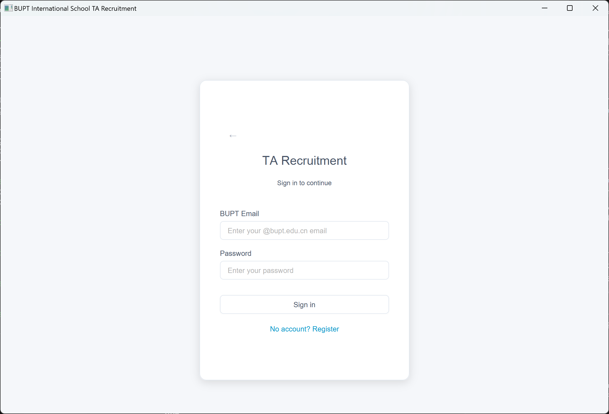
   
  <small>Figure 3-1: Sign-in screen</small>

#### Sign-in dialogs

| Situation | Dialog title | Message (summary) |
|-----------|--------------|-------------------|
| Wrong portal for MO/Admin | Error | MO/Admin accounts must sign in from the MO portal. |
| Wrong portal for TA | Error | TA accounts must sign in from the TA portal. |
| Invalid credentials | Error | Message from system (e.g. incorrect password, unknown user) |
| Empty fields | Error | Validation message (e.g. email or password required) |

#### TA Portal: login notice banner

When redirected from a protected action, a **yellow notice banner** may appear at the top of the login screen (*"Please sign in first."*) and auto-hides after a few seconds.

### 3.3 Registration screen

Open via **No account? Register** on the sign-in screen.

| UI element | Description |
|------------|-------------|
| **←** | TA Portal: back to guest browse |
| **Create Account** | Heading |
| **Register as TA / MO** hint | Role fixed by portal |
| **BUPT Email** | Must end with `@bupt.edu.cn` |
| **Password** / **Confirm Password** | Must match |
| **Register** | Create account → success returns to sign-in |
| **Back to sign in** | Cancel registration |

  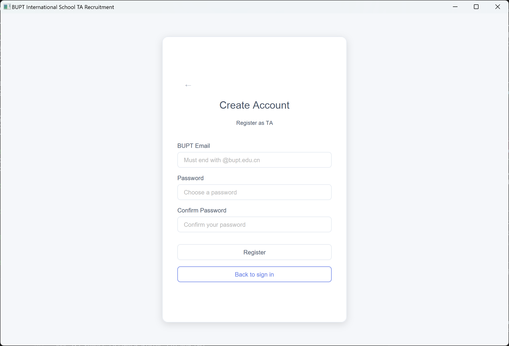
   
  <small>Figure 3-2: Registration screen</small>

#### Registration dialogs

| Situation | Dialog | Typical message |
|-----------|--------|-----------------|
| Empty email | Error | Email cannot be empty. |
| Empty password | Error | Password cannot be empty. |
| Empty confirm | Error | Please confirm your password. |
| Success | Information | Registration succeeded → navigates to sign-in |
| Failure | Error | Duplicate email, password mismatch, invalid email, etc. |

### 3.4 Change Password dialog (TA and MO)

Opened from **My profile** → **Change Password**.

| Field / button | Description |
|----------------|-------------|
| **Current password** | Verify identity |
| **New password** | New secret |
| **Confirm new password** | Must match new password |
| **Cancel** | Close without saving |
| **Confirm** | Apply change |
| Inline status label | Shows validation errors in red |

On success, an **Information** dialog shows: *"Password changed successfully!"*

  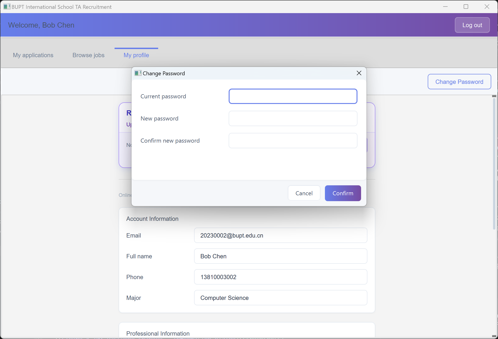
   
  <small>Figure 3-3: Change Password window</small>

#### Change Password — feedback

| Situation | Feedback | Message or behavior |
|-----------|----------|---------------------|
| Empty current, new, or confirm field | Inline (red) | Please fill in all fields |
| Wrong current password | Inline (red) | Current password is incorrect |
| New password empty | Inline (red) | New password is required |
| New and confirm do not match | Inline (red) | New passwords do not match |
| Account not found | Inline (red) | Account not found |

---

## 4. TA Portal — User Guide

### 4.1 TA Portal main window

After launch (guest) or sign-in, the **TA Console** dashboard appears with three tabs:

| Tab | Guest | Signed-in TA |
|-----|-------|--------------|
| **Browse jobs** | ✓ Full access (except Apply / AI) | ✓ Full access |
| **My applications** | Redirects to sign-in | ✓ |
| **My profile** | Redirects to sign-in | ✓ |

Guest users open on **Browse jobs**. After a successful sign-in, TAs land on **My applications**.

**Toolbar**

| State | Welcome text | Button |
|-------|--------------|--------|
| Guest | Browse jobs as guest | **Log in** |
| Signed in | Welcome, \<name\> | **Log out** |

#### Guest tab guard

Clicking **My applications** or **My profile** while not signed in shows a notice and opens the **sign-in** screen with banner *"Please sign in first."*

---

### 4.2 Browse jobs

The default tab for guests and the primary job-discovery area for TAs.

#### Layout

| Area | Contents |
|------|----------|
| **Search bar** | Search by title, module, requirements; **Refresh** |
| **Job table** | Job ID, Title, Module, Posted by, Positions, Applicants, Hired |
| **Job details** (right panel) | Title, Posted by, Module, Positions, Dates, Requirements, Notes, Keywords |
| **AI Resume Optimization Advice** | Text area + **Generate AI Resume Advice** |
| **Apply** | Submit application (signed-in only) |
| **AI sidebar** (bottom/right) | Optional preference text, **Reset**, **AI Recommend Jobs**, **AI Job Recommendations** results |

  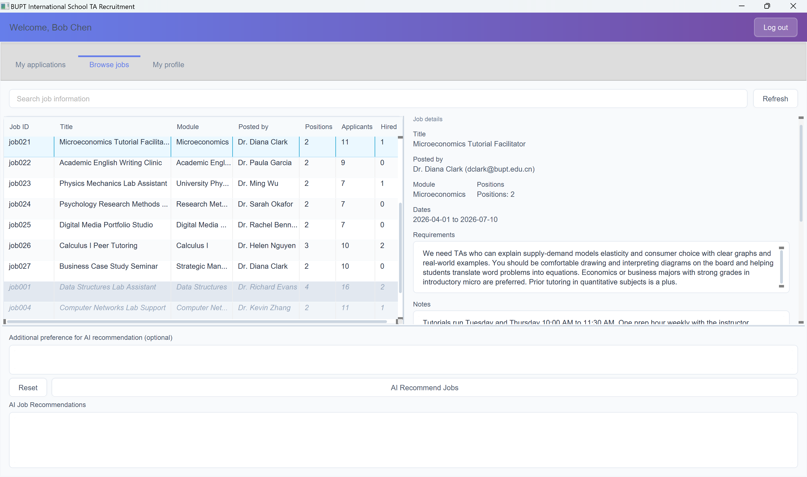 
  <small>Figure 4-1-1: Browse jobs — full layout overview 1</small> 
  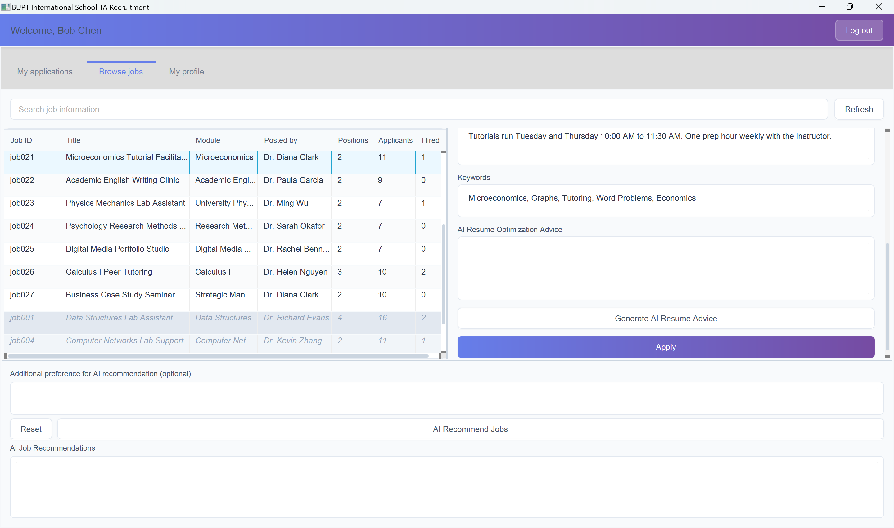 
  <small>Figure 4-1-2: Browse jobs — full layout overview 2</small>

#### Step-by-step: Browse and search

1. Open **Browse jobs**.
2. Type keywords in **Search title, module, requirements** (optional).
3. Click **Refresh** to reload open jobs from the system.
4. Click a row in the job table; details appear on the right.

#### Step-by-step: Apply for a job (signed-in)

1. Sign in if you are a guest.
2. In the job table, rows for positions you have **already applied** to are shown greyed out and the **Apply** button reads **Already Applied**. All other rows are open positions you can still apply to—select one of those.
3. Review **Job details** and optionally use **Generate AI Resume Advice** to help improve your resume and strengthen your application.
4. Click **Apply**.
5. On success, an **Information** dialog confirms submission; **My applications** updates.

| Situation | Dialog |
|-----------|--------|
| Guest clicks Apply | Redirect to sign-in (*Please sign in first.*) |
| Apply succeeded | Information with confirmation message |

  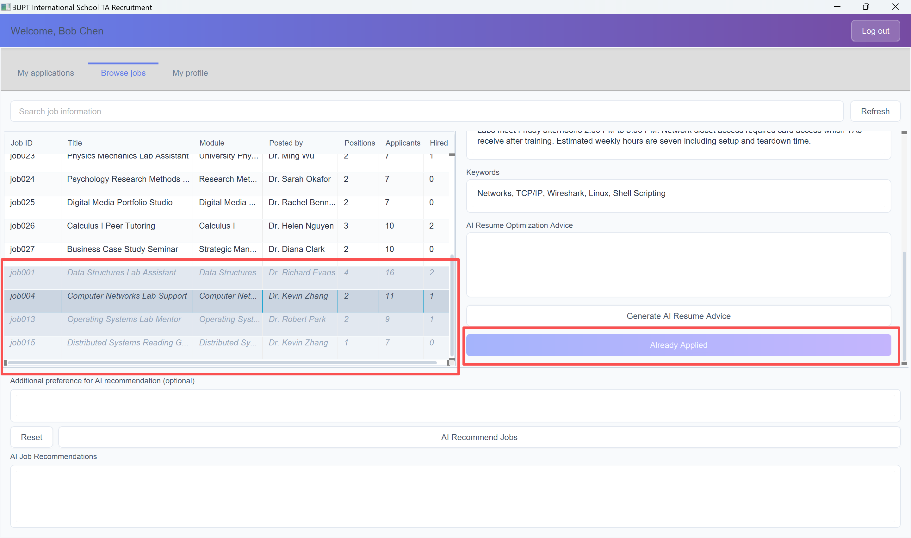
   
  <small>Figure 4-2: Browse jobs — already applied</small>

#### Generate AI Resume Advice (signed-in)

1. Select a job.
2. Click **Generate AI Resume Advice**.
3. Advice appears in the **AI Resume Optimization Advice** area.

  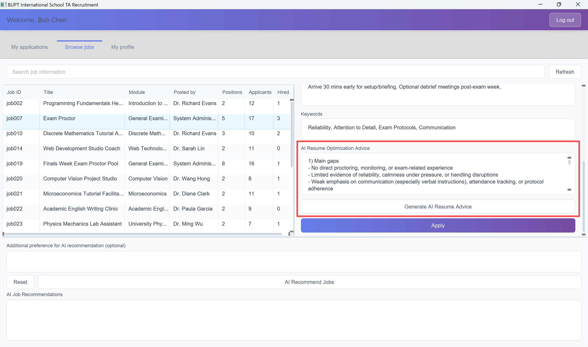
   
  <small>Figure 4-3: AI Resume Advice generated for selected job</small>

> **Example — AI Resume Optimization Advice**
> 
> *1) Main gaps*
> 
> *- No direct proctoring, monitoring, or exam-related experience*
> *- Limited evidence of reliability, calmness under pressure, or handling disruptions*
> *- Weak emphasis on communication (especially verbal instructions), attendance tracking, or protocol adherence*
> *- Missing proof of punctuality, schedule flexibility, or procedural diligence*
> 
> *2) Immediate rewrite suggestions*
> 
> *- Replace "TA" focus with proctor-relevant traits: reliability, observation, procedure-following, calm authority*
> *- Add concrete examples of responsibility, timeliness, or rule enforcement (even non-academic)*
> *- Highlight English fluency and ability to give clear, calm verbal instructions*
> *- Quantify availability (e.g., "available for early-morning/variable shifts") and commitment to briefings*
> 
> *3) Example phrasing*
> 
> *- "Reliable and detail-oriented student with proven punctuality—consistently arrived 30+ mins early for lab setups and deadline-critical coursework."*
> *- "Calm and observant in high-focus settings; monitored peer debugging sessions for 15+ hours/week, identifying subtle errors (e.g., memory leaks, aliasing) before escalation."*
> *- "Fluent English speaker; gave clear, step-by-step verbal instructions during dorm study groups—adapted tone and pace for frustrated peers."*
> *- "Committed to integrity and protocol: followed strict lab safety/checklist procedures, documented all deviations, and reported issues immediately to instructors."*

#### AI Recommend Jobs (signed-in)

1. Optionally enter text under **Additional preference for AI recommendation (optional)**.
2. Click **AI Recommend Jobs**.
3. Matching jobs are highlighted/reordered in the table; results appear under **AI Job Recommendations**. **Reset** clears that output and table highlighting.

Guest users are redirected to sign-in if they use this feature.

  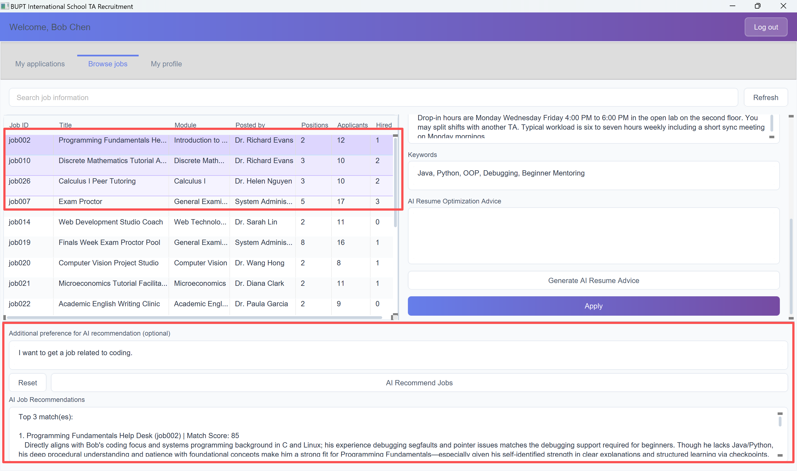
   
  <small>Figure 4-4: Browse jobs — AI recommendations displayed</small>

> **Example — AI Job Recommendations**
> 
> *Top 3 match(es):*
> 
> *1. Programming Fundamentals Help Desk (job002) | Match Score: 85*
> 
> *&nbsp;&nbsp;Directly aligns with Bob's coding focus and systems programming background in C and Linux; his experience debugging segfaults and pointer issues matches the debugging support required for beginners. Though he lacks Java/Python, his deep procedural understanding and patience with foundational concepts make him a strong fit for Programming Fundamentals—especially given his self-identified strength in clear explanations and structured learning via checkpoints.*
> 
> *2. Discrete Mathematics Tutorial Assistant (job010) | Match Score: 62*
> 
> *&nbsp;&nbsp;Discrete Mathematics requires logic, precision, and clear step-by-step reasoning—skills reinforced by Bob's systems coursework (e.g., pointer arithmetic, memory management) and his self-described thoroughness and attention to detail. While not coding-focused, it leverages his analytical rigor and preference for explicit structure, and is more aligned than non-technical roles.*
> 
> *3. Calculus I Peer Tutoring (job026) | Match Score: 48*
> 
> *&nbsp;&nbsp;Calculus tutoring relies on quantitative reasoning and explaining common errors—transferable from Bob's debugging patience and study-group mentoring—but lacks direct coding relevance and assumes stronger formal math application than evidenced in his profile. Score reflects moderate alignment with his teaching style (patience, clarity) but low domain match.*

---

### 4.3 My applications

Available only when signed in. Lists all applications submitted by the current TA.

#### Table columns

| Column | Description |
|--------|-------------|
| Application ID | Unique application identifier |
| Job title | Position name |
| Module | Academic module |
| Job Period | Start–end dates of the job |
| Status | Pending / Withdrawn / Hired / Not hired |
| Hired Time | Timestamp when hired (if applicable) |

#### Actions

| Button | Description |
|--------|-------------|
| **Withdraw** | Cancel a **Pending** application |

  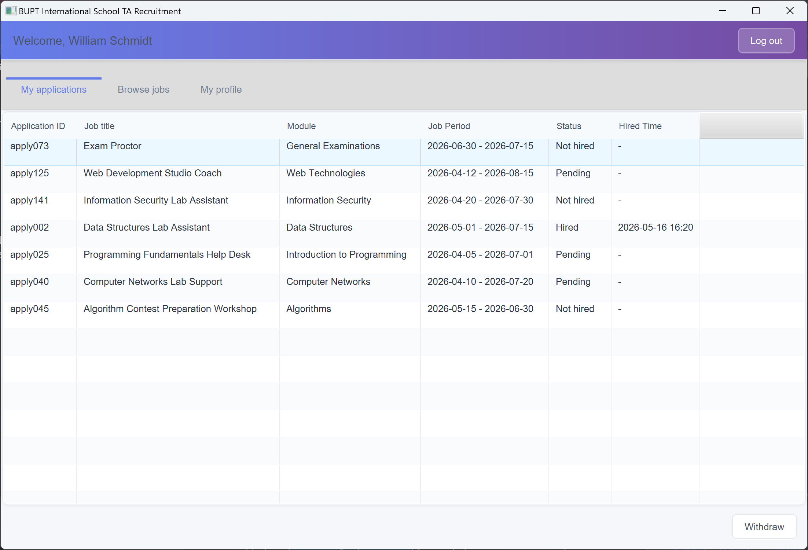
   
  <small>Figure 4-5: My applications</small>

#### Step-by-step: Withdraw an application

1. Open **My applications**.
2. Select a row with status **Pending**.
3. Click **Withdraw**.
4. In the **Confirm** dialog, choose **OK** (*"Withdraw this application?"*).
5. Status changes to **Withdrawn**; job applicant counts refresh.

| Situation | Dialog |
|-----------|--------|
| Not Pending | Error: *Only pending applications can be withdrawn* |
| Confirm withdraw | Confirm → OK / Cancel |

---

### 4.4 My profile

Manage your online profile and résumé attachment.

#### Sections

**Resume attachment (Quick start)**

| Control | Description |
|---------|-------------|
| Status label | Shows uploaded file name or *No file uploaded* |
| **Upload CV** | Pick a `.txt` file (file chooser) |
| **Download** | Save CV to disk (file chooser) |
| **Delete** | Remove attachment |
| **AI Fill from CV** | Parse CV and draft profile fields |
| AI fill status label | Progress / result text |

**Online profile**

| Section | Fields |
|---------|--------|
| Account Information | Email (read-only), Full name, Phone, Major |
| Professional Information | Skills, Experience, Self evaluation |
| **Save profile** | Persist changes |
| **Change Password** | Opens password dialog (Section 3.4) |

  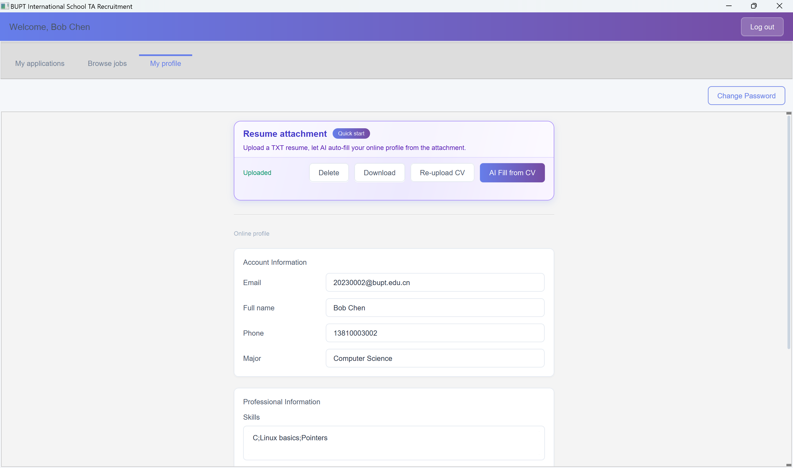 
  <small>Figure 4-6-1: TA My profile 1</small> 
  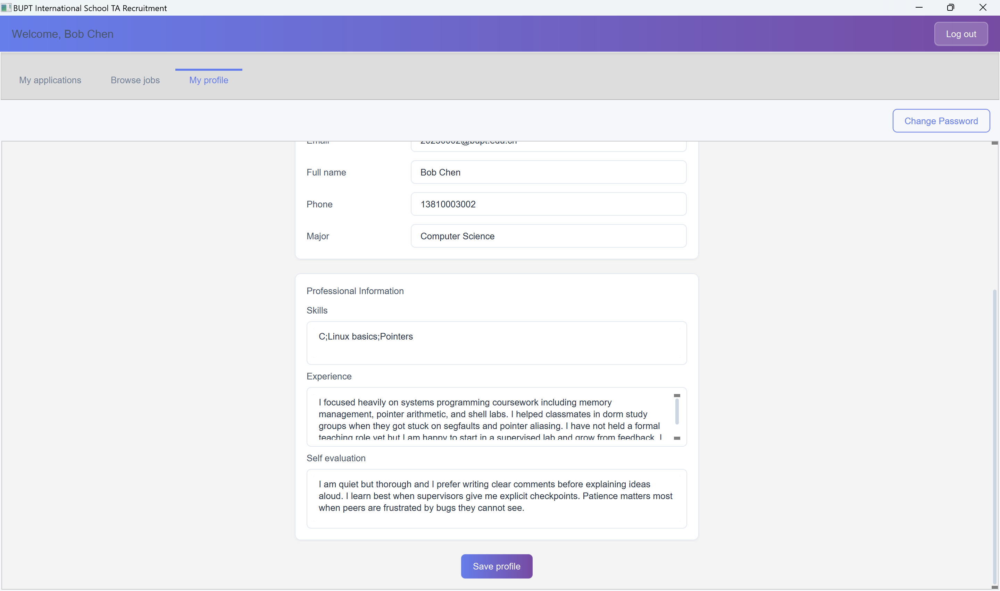 
  <small>Figure 4-6-2: TA My profile 2</small>

#### Step-by-step: Upload and AI-fill CV

1. Click **Upload CV**.
2. In the file chooser, select a **`.txt`** résumé only.
3. On success, **Information**: *"CV uploaded"*.
4. Click **AI Fill from CV**; review populated fields.
5. Click **Save profile**.

| Situation | Dialog |
|-----------|--------|
| Upload success | Information: *CV uploaded* |
| Delete CV | Confirm Yes/No: *Delete your uploaded resume attachment?* → Info *CV deleted* |
| Download success | Information: *CV saved to: \<path\>* |
| AI fill failure | Error: *AI fill failed: …* |

#### Unsaved changes when leaving profile tab

If you edit profile fields and switch to another tab without saving:

**Confirm** dialog (Yes/No): *"You have unsaved profile changes. Save before leaving this page?"*

- **Yes** → saves profile  
- **No** → discards edits and reloads saved data  

#### Save profile

Click **Save profile**. **Information** or **Error** dialog reports the result; the welcome label updates if your display name changed.

---

### 4.5 TA Portal — Log out

Click **Log out** in the toolbar. You return to **guest mode** on **Browse jobs**; session data is cleared from memory.

---

## 5. MO Portal — User Guide

### 5.1 MO Portal main window

After sign-in, the **MO Console** dashboard opens. Standard MO users see four tabs; administrators see additional tabs (Section 6).

**Toolbar:** Welcome message + **Log out** (always visible).

| Tab | Purpose |
|-----|---------|
| **Applicants** | Review and decide on applicants for your open jobs |
| **My jobs** | List and manage jobs you posted |
| **Post / edit job** | Create new jobs or edit existing ones |
| **My profile** | MO account and contact details |

---

### 5.2 Applicants

Review applications for **your open jobs** only.

#### Layout

| Area | Contents |
|------|----------|
| **Job selector** | Dropdown: *Select an open job* |
| **Search** | Filter applicant cards |
| **Refresh** | Reload applicant list |
| **Applicant cards** | Name, status badge, one-line **AI advantage summary** (auto-generated), optional **★ TOP MATCH** badge after AI recommend |
| **Applicant profile** | Detailed TA information for selected card |
| **Download CV** | Save applicant’s CV |
| **Hire** / **Reject** | Decision buttons (Pending only) |
| **AI Recommend Applicants** | Preference, Top N spinner, **Reset**, **AI Recommend Applicants** |
| **AI Analysis** | Read-only text area for AI output |

  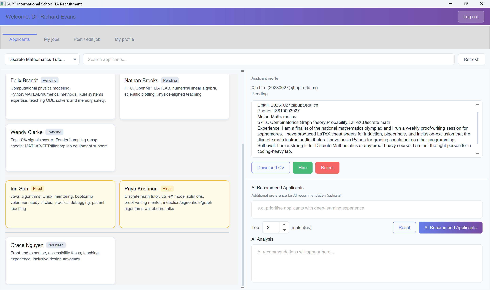
   
  <small>Figure 5-1: Applicants</small>

#### Step-by-step: Review and hire

1. Select an **open job** from the dropdown.
2. Scan **applicant cards**; read each card’s AI advantage summary to compare candidates at a glance.
3. Click an **applicant card** to load **Applicant profile**.
4. Optionally click **Download CV** (file chooser → save path).
5. Click **Hire**.
6. **Confirm**: *"Hire this applicant?"* → **OK**.
7. If the TA already has **2 or more overlapping hired jobs**, a **Confirm** Yes/No warning lists existing jobs and asks whether to proceed.
8. On success, **Information** shows result; applicant list refreshes.
9. Optionally, **Recommend Similar Candidates** dialog appears (Section 5.2.1).

#### Step-by-step: Reject

1. Select a **Pending** applicant.
2. Click **Reject**.
3. **Information** or **Error** reports outcome (no separate confirm for reject).

| Situation | Dialog |
|-----------|--------|
| Hire confirm | Confirm: *Hire this applicant?* |
| Concurrent jobs warning | Confirm Yes/No with overlapping job list |
| CV missing | Error: *CV file not found* |
| CV saved | Information: *CV saved to: \<path\>* |

  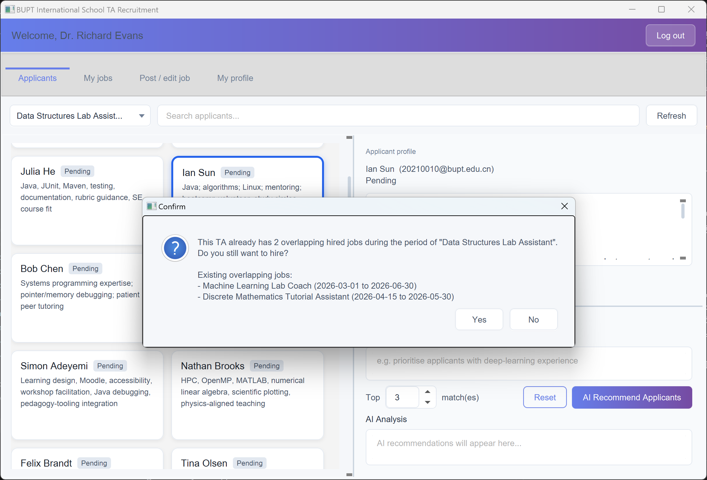
   
  <small>Figure 5-2: Hire — concurrent jobs Yes/No warning</small>

#### AI advantage summary on applicant cards

For each applicant on the selected job, the system **automatically generates a short AI sentence** on that person’s card summarising their main strengths (for example skills or experience relevant to the role). This lets you scan the card list quickly before opening **Applicant profile**.

- While the text is still being generated, the card shows *Analyzing profile...*
- Once ready, the sentence appears on the card under the name and status.
- The same summary is kept on the applicant’s record so it can load faster when you view them again; if the TA updates their online profile or CV attachment, that cached summary is cleared and regenerated the next time you open Applicants.

  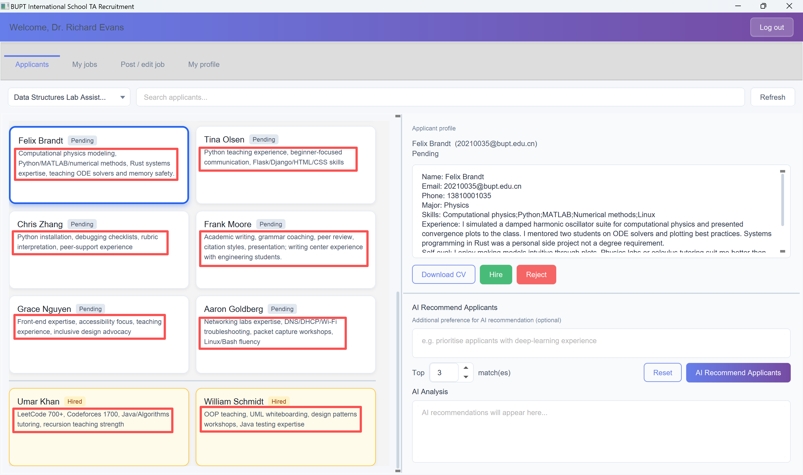
   
  <small>Figure 5-3: Applicant card — AI advantage summary</small>

#### AI Recommend Applicants

1. Select an open job with **pending** applicants.
2. Optionally enter preference text (e.g. *prioritise applicants with deep-learning experience*).
3. Set **Top** N matches (1–10).
4. Click **AI Recommend Applicants**.
5. Results appear in **AI Analysis**.

| Situation | Dialog |
|-----------|--------|
| No applicants | Error: *No applicants for this job* |
| No pending applicants | Error: *No pending applicants for this job* |

  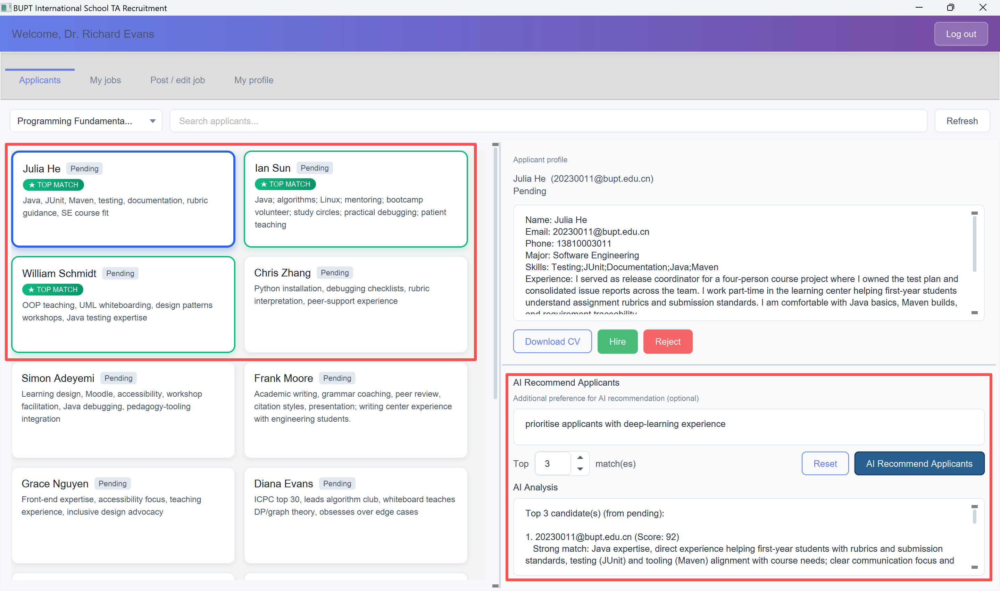
   
  <small>Figure 5-4: AI Recommend Applicants</small>

> **Example — AI Analysis (AI Recommend Applicants)**
>
> *Top 3 candidate(s) (from pending):*
> 
> *1. 20230011@bupt.edu.cn (Score: 92)*
> 
> *Strong match: Java expertise, direct experience helping first-year students with rubrics and submission standards, testing (JUnit) and tooling (Maven) alignment with course needs; clear communication focus and self-awareness. No deep-learning background, but MO preference is secondary to core job requirements.*
> 
> *2. 20210010@bupt.edu.cn (Score: 88)*
> 
> *Excellent fit: Java + mentoring experience across bootcamps and study circles, covers recursion, unit tests, CLI workflows — all relevant; emphasizes patience, practical hints, and independent problem-solving. No deep-learning, but strong foundational teaching alignment.*
> 
> *3. 20210026@bupt.edu.cn (Score: 85)*
> 
> *Highly qualified: proven TA for OOP course twice, UML/whiteboarding, design patterns, JUnit/Mockito — directly supports procedural/OO fundamentals and debugging explanations; blog outreach shows teaching clarity. MO deep-learning preference not met, but domain expertise and teaching record are exceptional.*

#### 5.2.1 AI Recommend Similar Candidates (after hire)

After you click **Hire** on a pending applicant and confirm *Hire this applicant?*, this dialog can appear whenever you have **finished evaluating that person as someone you would hire**—not only when the hire is recorded. It shows in both cases below:

- **Hire completed** — the applicant is successfully hired (including when you choose **Yes** on the concurrent-jobs warning and the hire goes through).
- **Hire not completed due to workload** — the TA already has **2 or more overlapping hired jobs**, you see the concurrent-jobs warning, and you choose **No** (you decide not to hire this person because of their existing commitments).

In either case, the system treats that applicant as your reference and offers AI suggestions for other **pending** candidates with a similar profile.

| Element | Description |
|---------|-------------|
| Reference applicant | Name of the TA you just hired or considered hiring |
| Spinner | Number of candidates (1–10), default 3 |
| **Yes** / **No** | Proceed or skip |

  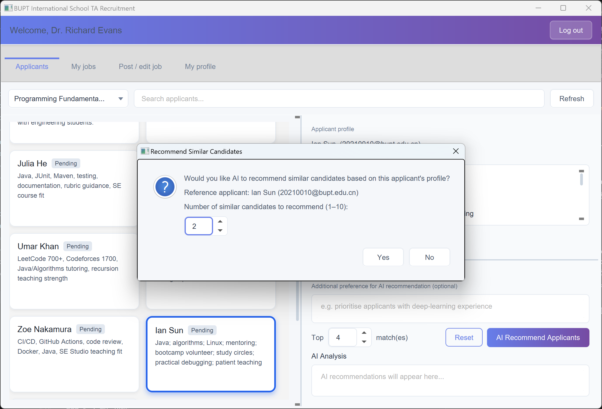 
  <small>Figure 5-5: AI Recommend Similar Candidates dialog</small> 
  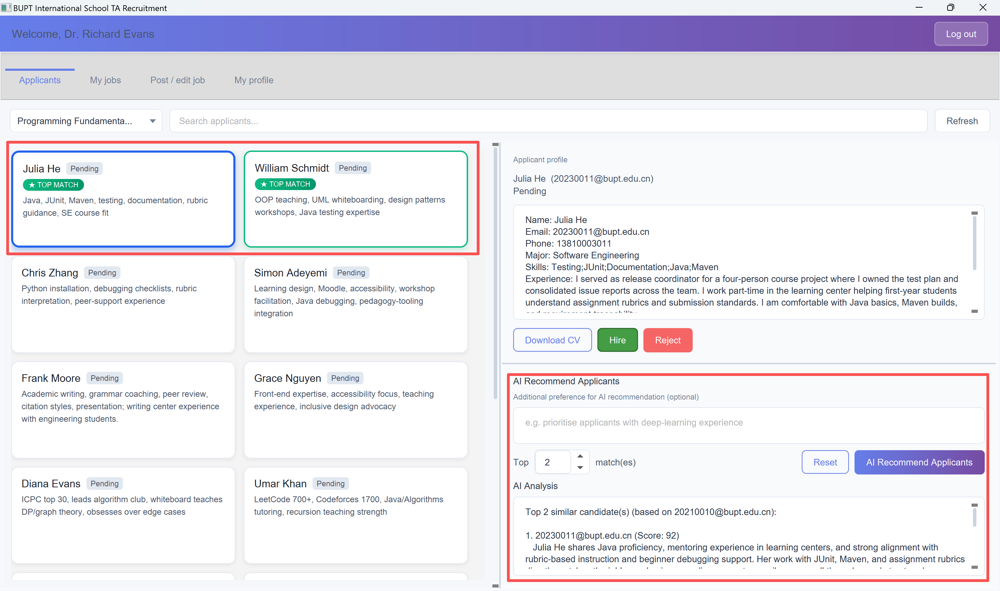 
  <small>Figure 5-6: AI Recommend Similar Candidates</small>

> **Example — AI Analysis (AI Recommend Similar Candidates)**
>
> *Top 2 similar candidate(s) (based on 20210010@bupt.edu.cn):*
> 
> *1. 20230011@bupt.edu.cn (Score: 92)*
> 
> *Julia He shares Java proficiency, mentoring experience in learning centers, and strong alignment with rubric-based instruction and beginner debugging support. Her work with JUnit, Maven, and assignment rubrics directly matches the job's emphasis on grading support, compiler error walkthroughs, and structured small-assignment help—mirroring Ian Sun’s bootcamp mentoring and QA triaging background.*
> 
> *2. 20210026@bupt.edu.cn (Score: 87)*
> 
> *William Schmidt has deep Java and OOP expertise, prior TA experience for OOP courses, and a demonstrated ability to explain foundational concepts (e.g., design patterns via whiteboard examples), closely matching Ian Sun’s strength in teaching procedural/OOP basics and mentoring. His workshop facilitation and blog outreach reflect similar pedagogical communication style and patience.*

---

### 5.3 My jobs

Manage jobs **you** have posted.

#### Layout

| Area | Contents |
|------|----------|
| **Search jobs** + **Refresh** | Filter and reload |
| **Jobs table** | ID, Title, Module, Positions, Status (Open/Closed) |
| **Job details** | Full description, requirements, notes, keywords |
| **Edit** | Open job in Post / edit tab |
| **Close** | Close an open job |
| **Open** | Re-open a closed job |
| **Applicants** | Jump to Applicants tab for this job |

  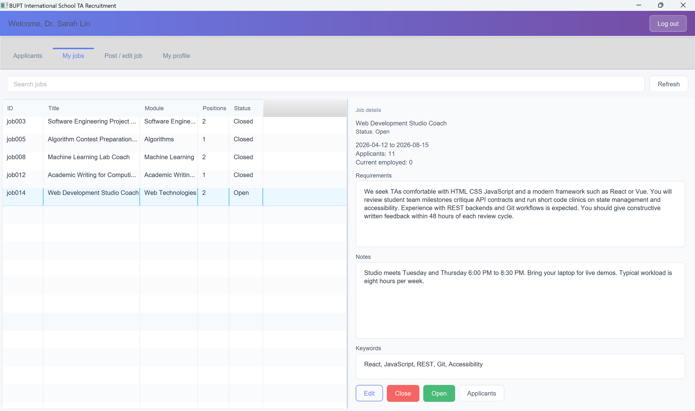
   
  <small>Figure 5-7: My jobs</small>

#### Step-by-step: Close or re-open a job

**Close**

1. Select a job with status **Open**.
2. Click **Close**.
3. **Confirm**: *"Close this job?"* → **OK**.
4. Job status becomes **Closed**; new applications are blocked.

**Re-open**

1. Select a **Closed** job.
2. Click **Open**.
3. **Confirm**: *"Re-open this job?"* → **OK**.

| Situation | Dialog |
|-----------|--------|
| Already closed | Information: *This job is already closed* |
| Already open | Information: *This job is already open* |
| Applicants on closed job | Information: *This job is closed. Re-open it before reviewing applicants.* |

#### Jump to Applicants

1. Select a job → click **Applicants**.
2. System switches to **Applicants** tab and pre-selects that job in the dropdown.
3. If the job is closed, you see the re-open reminder instead.

---

### 5.4 Post / edit job

Create a new posting or edit an existing one.

#### Form sections

| Section | Fields |
|---------|--------|
| Header | **New job** or existing Job ID label |
| **Basic Information** | Job title, Module, Positions, Start date, End date |
| **Job Details** | Requirements (large text), Notes (large text), Keywords |
| **AI Generate Keywords** | Fills keywords from requirements/notes |
| **Clear** | Reset form for a new job |
| **Save** | Create or update job |

  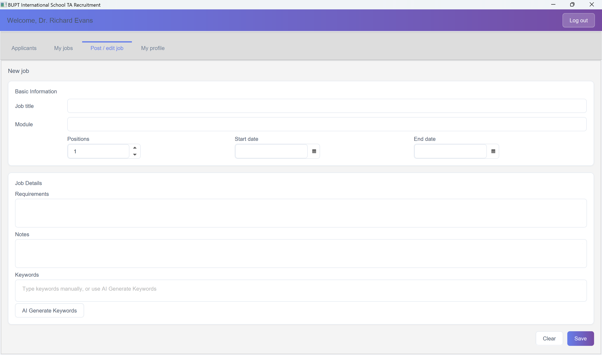 
  <small>Figure 5-8: Post / edit job — new job form</small> 
  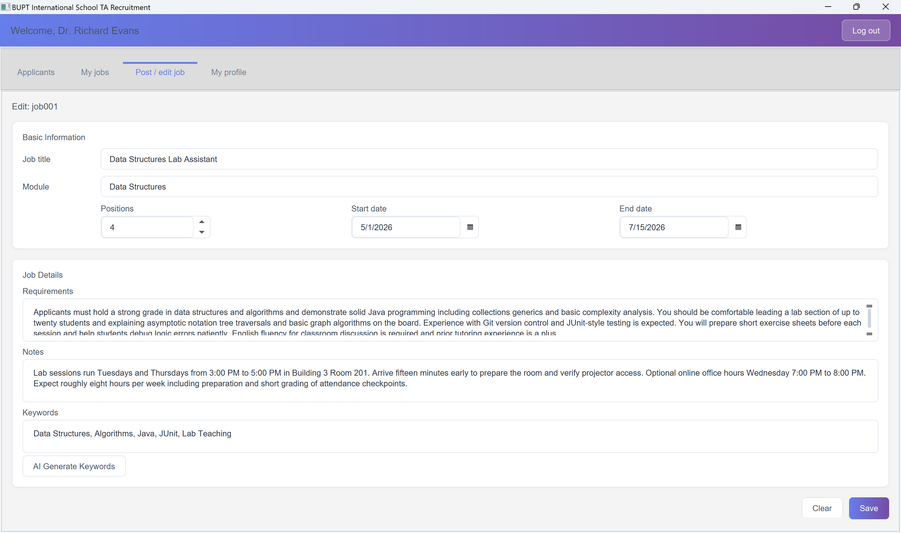 
  <small>Figure 5-9: Post / edit job — editing existing job</small>

#### Step-by-step: Post a new job

1. Open **Post / edit job** (or click **Clear** if the form has leftover data).
2. Fill **Job title**, **Module**, **Positions**, **Start date**, **End date**.
3. Enter **Requirements** and **Notes**.
4. Optionally click **AI Generate Keywords** (wait for *Generating...* to finish); you may also edit keywords manually.
5. Click **Save**.
6. **Information** or **Error** confirms outcome; job appears under **My jobs**.

---

### 5.5 My profile (MO)

| Section | Fields |
|---------|--------|
| Account Information | Email (read-only), Full name |
| Contact Information | Phone |
| Professional Information | Responsible modules (text area) |
| **Save profile** | Save MO profile |
| **Change Password** | Same dialog as TA (Section 3.4) |

  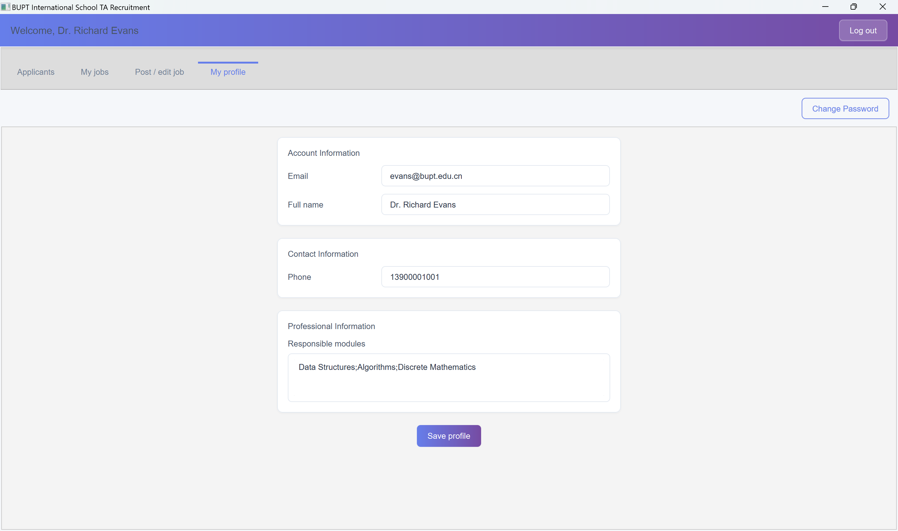
   
  <small>Figure 5-10: MO My profile</small>

---

### 5.6 MO Portal — Log out

Click **Log out** → returns to **sign-in** screen. Unsaved work in forms may be lost; save jobs and profile first.

---

## 6. Administrator Guide (MO Portal)

Sign in to the **MO/Admin Portal** with your **administrator account**. The dashboard adds **six administrator tabs**; the default selected tab is **TA admin**.

| Tab | Purpose |
|-----|---------|
| **TA admin** | Manage all TA accounts |
| **MO admin** | Manage MO accounts (admin account excluded from list) |
| **All jobs** | View and close/open any job system-wide |
| **Insights** | Analytics dashboard and 30-day AI insights |
| **Account Management Log** | Audit trail for user admin actions |
| **Job Management Log** | Audit trail for job admin actions |

---

### 6.1 TA admin

The screen is split into a **left** TA accounts list and a **right** detail panel. Click a row on the left to select that TA — the selected row is highlighted **blue** — and the right side shows that person’s **Jobs Applied** and **Jobs Hired** tables (application and hire history).

**Left — TA accounts table:** Name, Phone, Email, **Ongoing Jobs** (currently in-progress hired positions), **Applied** (how many jobs they have ever applied to, including ended jobs), **Hired** (how many jobs they have ever been hired for, including ended jobs), Status.

- Rows with a **light red** background indicate the TA has **more than 2** ongoing hired jobs (the workload warning threshold is **2**). This flags that the person may already be under heavy commitment; take it into account when hiring. The same rule triggers a **Confirm** warning when an MO tries to **Hire** that TA and they already have **2 or more** overlapping hired jobs (see Section 5.2).

**Right — TA Details**

| Table | Content |
|-------|---------|
| **Jobs Applied** | Jobs this TA has applied to (non-withdrawn applications) |
| **Jobs Hired** | Jobs where this TA was hired — **Hired Time**, **Work Period** |

In **Jobs Hired**, rows for jobs that are **currently in progress** (today falls between the job’s start and end dates) are highlighted **blue** so you can spot active assignments at a glance.

**Actions**

| Button | Effect |
|--------|--------|
| **Reset password** | Resets the user’s password; **Information** dialog shows the new temporary password, which is **`Pass@123`** by default. |
| **Enable / disable** | Toggles account; **Information** confirms |

  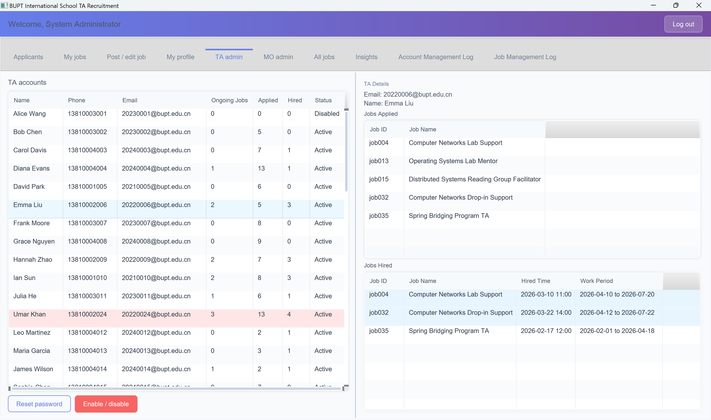
   
  <small>Figure 6-1: TA admin</small>

---

### 6.2 MO admin

Same layout pattern as TA admin for **MO accounts** — Name, Phone, Email, Classes, Status.

**Right panel:** MO Details and **Classes/Jobs** table (Job ID, Job Name, Positions, Hired, dates, Status).

| Button | Effect |
|--------|--------|
| **Reset password** | Resets the user’s password; **Information** dialog shows the new temporary password |
| **Enable / disable** | Toggle MO account |

  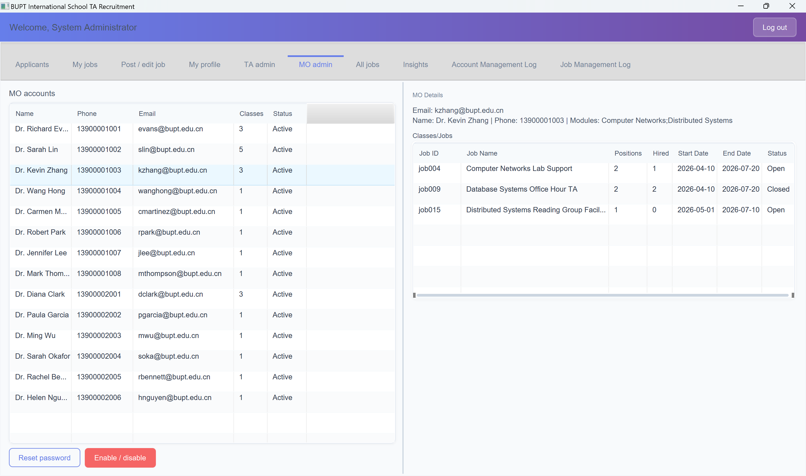
   
  <small>Figure 6-2: MO admin</small>

---

### 6.3 All jobs

System-wide job table: Job ID, Title, Module, Name (MO), Email, Positions, Hired, Start/End Date, Status.

| Button | Effect |
|--------|--------|
| **Close Job** | Close selected job (any owner) |
| **Open Job** | Re-open selected job |

Dialogs mirror MO **My jobs** close/open confirms and information messages.

  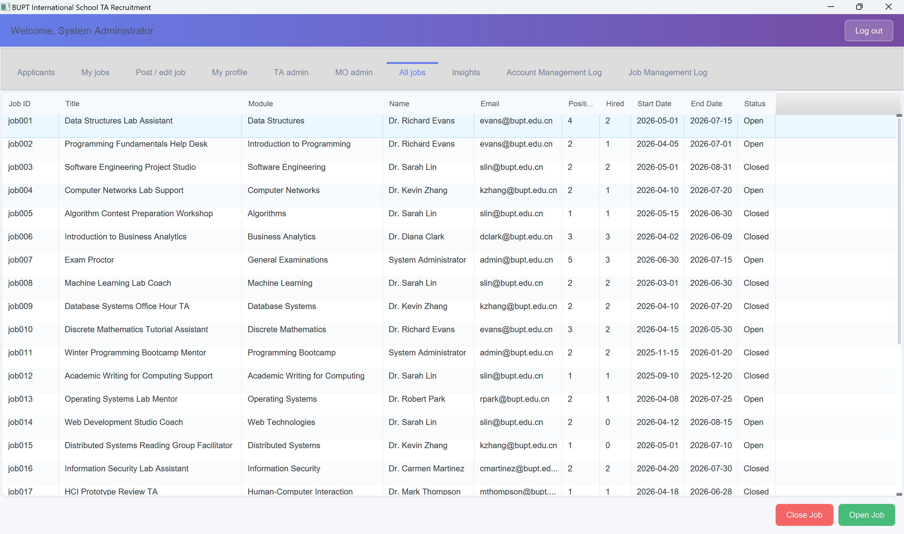
   
  <small>Figure 6-3: All jobs</small>

---

### 6.4 Insights

Embedded analytics panel (not a separate popup window).

| Section | Description |
|---------|-------------|
| **Metric cards** | Total Jobs, Open Jobs, Applications, Hired, Hire Rate |
| **Applications by Module** | Scrollable list; **Sort by Name** / **Sort by Count** |
| **Hiring Status Distribution** | Bar chart |
| **30-Day Insights** | AI-generated narrative; **Refresh** reloads |

  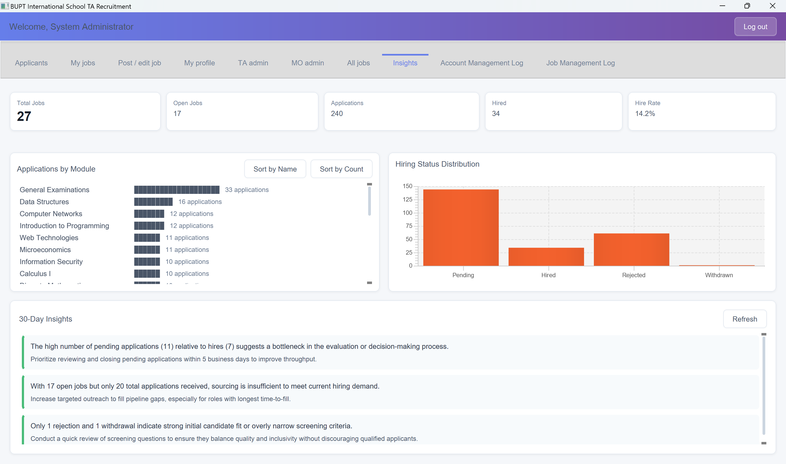
   
  <small>Figure 6-4: Insights</small>

---

### 6.5 Account Management Log

Read-only table: Time, Admin, Action, User Email, Role, Before, After.

| Button | Effect |
|--------|--------|
| **Clear Log** | **Confirm**: *Clear all account-management log entries? This cannot be undone.* → **Information** on success |

  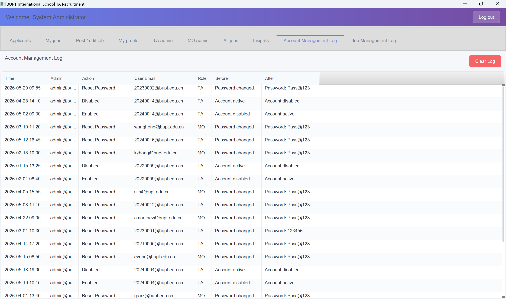
   
  <small>Figure 6-5: Account Management Log</small>

---

### 6.6 Job Management Log

Same pattern as account log for job-related admin actions: Time, Admin, Action, Job ID, Job Name, Before, After.

| Button | Effect |
|--------|--------|
| **Clear Log** | **Confirm** for job-management log → **Information** |

  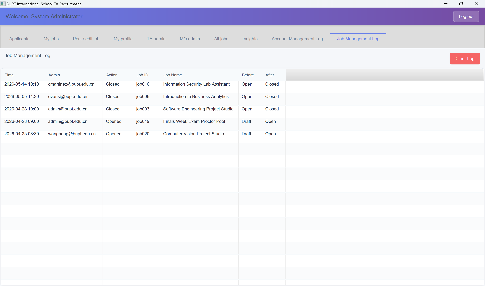
   
  <small>Figure 6-6: Job Management Log</small>

---

## 7. Application Status Reference

| Status (as shown in the app) | Meaning | TA: Withdraw? | MO: Hire/Reject? |
|------------------------------|---------|---------------|------------------|
| **Pending** | Application submitted, awaiting decision | Yes | Yes |
| **Withdrawn** | You cancelled before a decision was made | — | No |
| **Hired** | You were accepted for the position | No | No (already decided) |
| **Not hired** | The application was declined | No | No |

---

## 8. AI Features

| Feature | Role | Location | Requires sign-in |
|---------|------|----------|------------------|
| AI Recommend Jobs | TA | Browse jobs | Yes |
| Generate AI Resume Advice | TA | Browse jobs → job details | Yes |
| AI Fill from CV | TA | My profile | Yes |
| AI Generate Keywords | MO | Post / edit job | Yes |
| AI Recommend Applicants | MO | Applicants | Yes |
| Recommend Similar Candidates | MO | After hire | Yes |
| 30-Day Insights | ADMIN | Insights tab | Yes (admin) |

AI features require an **internet connection**. If a feature cannot run, the app shows an **Error** dialog with a short explanation—read the message and try again later, or continue without AI.

---